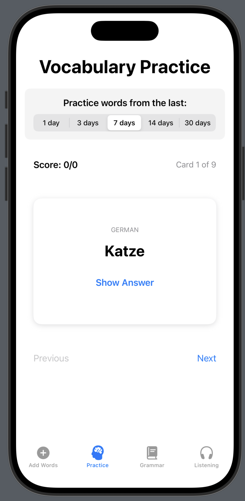

## My way of mastering German

### Modes

#### Add words
During the day you add words that intrigue you. Over time these will build a model of your level

#### Vocab Practise
Flashcard style practicing words that you have entered before

Coming: inject similar hard level words

#### Grammar
Genereted sentences for 

#### Listening
Will read up sentences with words that you have entered before.

Your task is to answer the comprehension questions.

