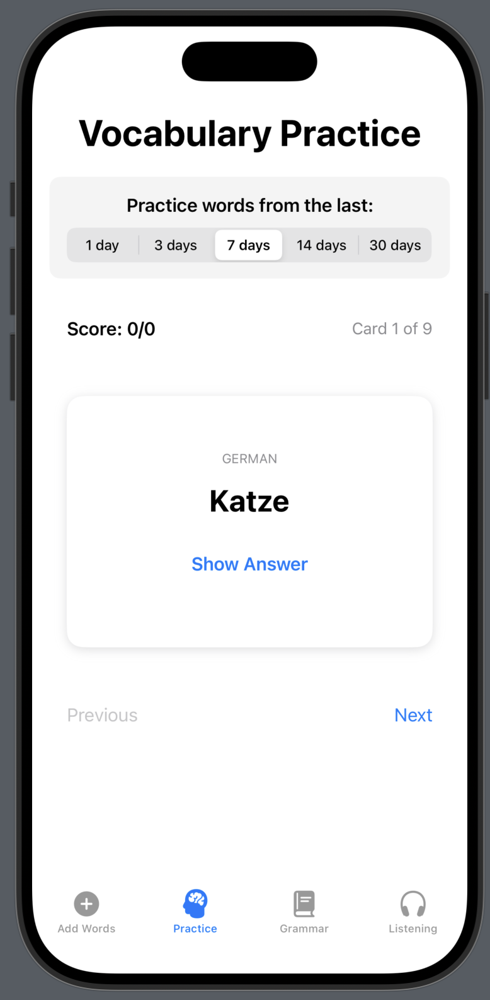

## An attempt to master german

With LLMs being language geniuses and apps now cheap to develop, why not tailor an app for learning german?

- Enter words that come up during your every day life.
- Ask the LLM for tailored quizzes for grammar (when to use `vor` vs `seit`) or for vocab such as house-hold items
- Generate custom stories at your specified, e.g. A2 level
  - Listen to the story for **listening comprehension**
  - and also generate questions from the story to test your **reading/hearing-comprehension**.

### Modes

#### Add words
During the day you add words that intrigue you. Over time these will build a model of your level

#### Vocab Practise
Flashcard style practicing words that you have entered before

Coming: inject similar hard level words

#### Grammar
Genereted sentences for 

#### Listening
Will read up sentences with words that you have entered before.

Your task is to answer the comprehension questions.

